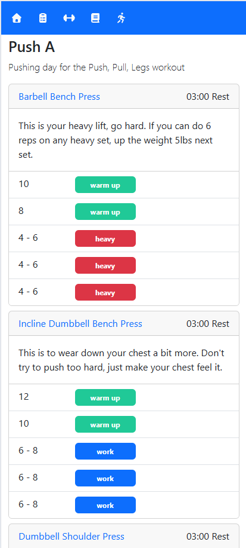
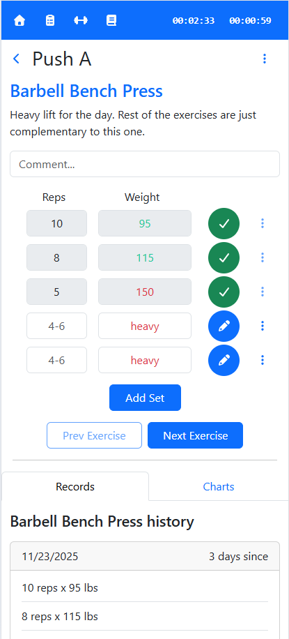
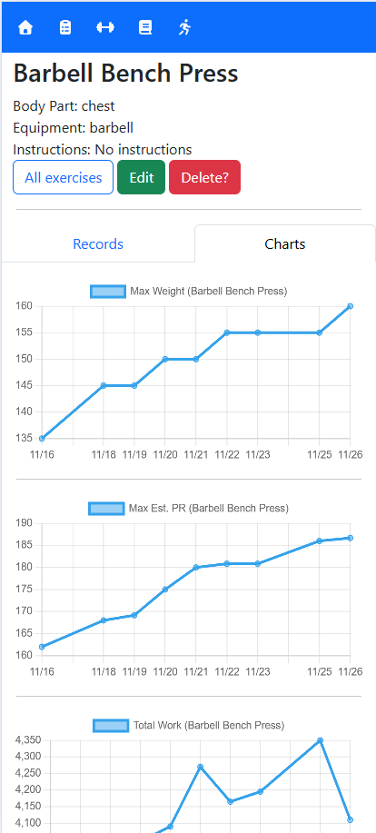

# Work-It-Out Front End

This is the Front End for my dream Gym Workout Tracking app. I've tried many and none seemed to have all of the parts I wanted, so I made my own. Here, lifters can create custom exercises, build & run their own workout templates, and view records & charts of their history for each exercise they've completed. Great for tracking one's gym progress and to help keep that gym discipline going!

The app is intended for mobile screens, but everything is possible on a full-sized computer as well.

Here is a [live version](https://workitoutapp-hraketdwbte4fpbs.westus2-01.azurewebsites.net/) of the app (note that it is deployed on low-cost Azure tiers, so the DB "wakeup time" might take a bit).

  

# How It's Made

Tech used: React, Redux, Bootstrap, Chart.js

This is a React Javascript SPA initiated by Vite that is hosted by a Backend For Frontend (BFF) Web API (https://github.com/erikbenton/WorkoutBackend). In the app, a workout is composed of lots of nested data that needs to be manipulated and possibly trigger events in other components. Redux was implemented to help manage the app's state by centralizing much of the state manipulation into reducers, as well as to allow the state to be easily injected across "far away" components (such as timers and modal prompts). In addition, redux made it easy to store the app state to the browser's Local Storage so that refreshing the browser would not lose a running workout's progress.

Bootstrap was used to help create a responsive layout. The app targets mobile screens since it's meant to be used in gyms for workout tracking, but it can be much easier to create workout templates and to type up their instructions on a full-size computer. Bootstrap components such as Modals and Dropdowns were very helpful keeping the lifter's UI/UX clean and easy to navigate, especially on a mobile screen.

A key component is the ability to plot the progress made on an exercise, and this was achieved with the Chart.js library. This is a lightweight chart library that made it easy to graph a lifter's progress on an exercise's using various calculations. This allows for a lifter to truly see if they are at a "sticking point" or rather progressing in a way that's hard to see looking at the raw data. The Chart.js library also makes it easy to expand and include new calculations.

# For the Future

- Add Users: WIP, see Identity Provider setup here (https://github.com/erikbenton/BentonIdentity)
- Create "time" and "distance" exercise sets rather than just weight eg: running, biking.
- Add React-Query for caching data rather than fetching it so often.

# Lessons Learned

* Redux and how to implement a complicated app state that's easy to share with other components without "muddying up" the code.
* Local Storage and how storing the app state there can help with browsers refreshing.
* UI/UX: How a good UI/UX can go a long way towards a User's enjoyment of an app, especially considering mobile screens. 
  - Needed to bush up on how CSS can be used to create a responsive layout with tools like "flex" and to undo some Bootstrap defaults.
  - Might try a different CSS framework (Material UI) in the future due to lacking Bootstrap vs React Bootstrap features and consistencies.

# Acknowledgements

[ZapSplat](https://www.zapsplat.com/) is thanked for allowing me to use their "bell small hand short ring" sound to notify the Lifter when their Rest Time is over.